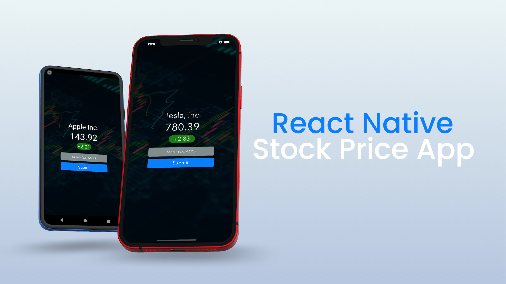

# React Native Stock Price App



The accompanying project source for training purposes on building and testing an app with React Native and using serenityJS + Cucumber + WebdriverIO for test automation

## Prerequisites

### Xcode and Android Studio

Having both installed allows us to test on the iOS Simulator and Android Emulator.

### Node.js

Node.js is a JavaScript runtime environment. You can download the pre-built installer of the Node.js LTS release for your OS from the official website:

https://nodejs.org/en/download/

_Note: For macOS users that have an M1 mac, you can alternatively use Node.js 16.X since this version has Apple Silicon support._

### Yarn

Yarn is a JavaScript package manager created by Facebook and it is an alternative to the `npm` client. After you've installed Node.js in the previous step, you can run the following command to install `yarn`:

```bash
$ npm install --global yarn@1.22.11
```

_Note: 1.22.11 is the current version of Yarn 1 (Classic) at the time of this project._

### Watchman (for macOS users)

Watchman is a tool created by Facebook for watching files in a given project directory and triggering actions when they change. You can install it via [Homebrew](http://homebrew.sh/):

```bash
$ brew install watchman
```

### Expo CLI

Expo CLI is a command line tool that helps scaffold React Native projects and provides the easiest way to get started. It also has a companion Expo client app that you can install on iOS and Android devices that allows you to preview your apps wirelessly. You can install it via `yarn`:

```bash
$ yarn global add expo-cli@4.11.0
```

_Note: 4.11.0 is the current version of the Expo CLI at the time of this project. Also for those more familiar with `npm` the command above is the yarn equivalent of `npm install --global expo-cli@4.11.0`_

### WebdriverIO

[WebdriverIO](https://webdriver.io/) is a popular JavaScript Appium client that provides its own API for issuing Appium commands. You can install as a development dependency from `yarn`:

```bash
$ yarn add webdriverio --dev
```

### Mocha

[Mocha](https://mochajs.org/) is a popular framework for structuring and running test suites, traditionally used by developers writing unit tests in JavaScript projects. Using Mocha in our project will provide a uniform template for structuring our test suites. You can install it as a development dependency from `yarn`:

```bash
$ yarn add mocha --dev
```

### Babel

[Babel](https://babeljs.io/docs/en/babel-preset-env) is a JavaScript compiler that allows us to use the latest and greatest JavaScript language features in NodeJS. You can install it as a development dependency from `yarn`:

```
$ yarn add @babel/preset-env --dev
```

### Appium Server

WebdriverIO acts as our Appium client, but we need to also run Appium Server, which will act as a bridge to translate the actions in our tests to the necessary logic in either UIAutomator2 or XCUITest behind the scenes. You can install it globally from `npm`:

```
$ npm install --global appium
```

git clone https://github.com/LayMui/react-native-stock-price-app.git

## expo eject

To run on iOS Simulator

```
yarn ios
```

To run on android emulator

```
yarn android
```

## FMI API

https://site.financialmodelingprep.com/developer

```
1. Register an account
2. Go to https://site.financialmodelingprep.com/developer/docs to get the API key
3. Create a .env file

Copy and paste the API key to the <api_key>
```

API_KEY=<api_key>

```
If you want to use different environments,
you basically set ENVFILE variable like this:
ENVFILE=.env.staging react-native run-android
```

reference:

```

https://www.npmjs.com/package/react-native-config

https://medium.com/tauk-blog/building-and-testing-native-mobile-apps-with-react-native-and-webdriverio-part-1-d51e73fbf573

```

## Install Appium Inspector

https://github.com/appium/appium-inspector/releases/tag/v2021.9.2

xattr -r -d com.apple.quarantine Appium\*

## Android

Make sure you set JAVA_HOME in the ~/.bash_profile

https://mkyong.com/java/how-to-set-java_home-environment-variable-on-mac-os-x/

## Integrate with browserstack

Bstack essentially provides you the cloud infra to run your tests.
So to run the test on browserstack you’ll have to run it in the same way you do it locally.
It’s just that the host and port address changes , everything else remains the same

https://www.browserstack.com/docs/app-automate/appium/getting-started/nodejs/webdriverio

Response to upload apk to bs:
bs://5ee775fbe778ecd2e00d27dbd7f02cbf3c190e5c

At wdio.conf.bs pass your username and accesskey

At wdio.android.app.conf.bs.ts pass the app url.

Command to run on bs:

```
 yarn android.bs.app 
```

podfile 
```
require_relative '../node_modules/react-native/scripts/react_native_pods'
require_relative '../node_modules/react-native-unimodules/cocoapods.rb'
require_relative '../node_modules/@react-native-community/cli-platform-ios/native_modules'

platform :ios, '12.0'

target 'reactnativestockpriceapp' do
  use_unimodules!
  use_modular_headers!
  config = use_native_modules!

  use_react_native!(:path => config["reactNativePath"])

  # Uncomment to opt-in to using Flipper
  #
  # if !ENV['CI']
  #   use_flipper!('Flipper' => '0.75.1', 'Flipper-Folly' => '2.5.3', 'Flipper-RSocket' => '1.3.1')
  #   post_install do |installer|
  #     flipper_post_install(installer)
  #   end
  # end
  pod 'react-native-safe-area-context', :path => '../node_modules/react-native-safe-area-context'
  pod 'glog', :podspec => '../node_modules/react-native/third-party-podspecs/glog.podspec', :modular_headers => false

end
```


xcodebuild clean archive -archivePath build/reactnativestockpriceapp.xcarchive -scheme reactnativestockpriceapp
```
note: Build preparation complete
note: Building targets in dependency order
error: No profiles for 'com.app.stockprice' were found: Xcode couldn't find any iOS App Development provisioning profiles matching 'com.app.stockprice'. Automatic signing is disabled and unable to generate a profile. To enable automatic signing, pass -allowProvisioningUpdates to xcodebuild. (in target 'reactnativestockpriceapp' from project 'reactnativestockpriceapp')
** ARCHIVE FAILED **
```


xcodebuild clean archive -archivePath build/reactnativestockpriceapp.xcarchive -scheme reactnativestockpriceapp -allowProvisioningUpdates

```
note: Build preparation complete
note: Building targets in dependency order
error: Cannot create a iOS App Development provisioning profile for "com.app.stockprice". Personal development teams, including "Lay mui Toh", do not support the Push Notifications capability. (in target 'reactnativestockpriceapp' from project 'reactnativestockpriceapp')
error: No profiles for 'com.app.stockprice' were found: Xcode couldn't find any iOS App Development provisioning profiles matching 'com.app.stockprice'. (in target 'reactnativestockpriceapp' from project 'reactnativestockpriceapp')
** ARCHIVE FAILED **
```

Add a fastlane plugin

bundle exec fastlane new_plugin